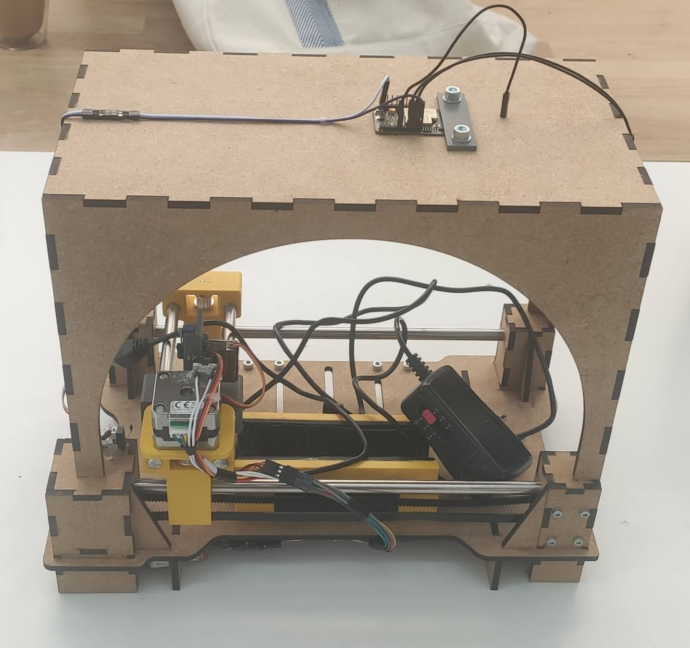
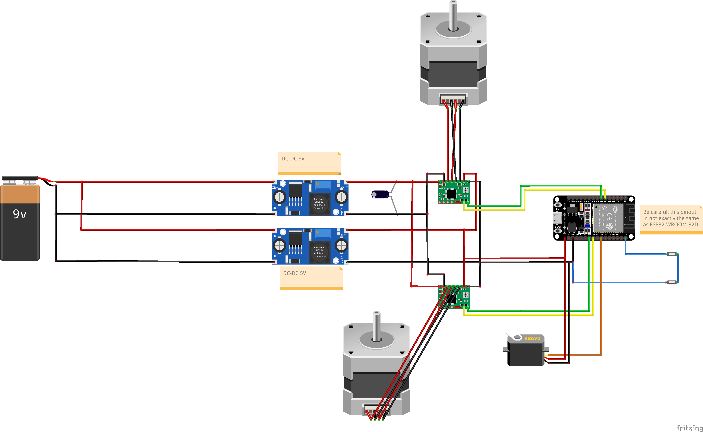

# Helping Hand

**Beyond Accessibility: Unleashing the Potential of Home Automation to Foster Independence and Inclusivity for Individuals with Unique Needs**

2024 - EPFL (CS-358) MIT - Group project

## Project's Overview

Helping Hand is an innovative project designed to enhance the independence of individuals with **mobility impairments** through adaptable **home automation**.
The core of the project is a **modular box** equipped with a **Wi-Fi** enabled microcontroller and a plotter like mechanism that allows **remote control** of various **household appliances**.
This system can be operated via a **smartphone or WEB application**, making it accessible for users with limited physical capabilities.

Inspired by the needs of Sean, a person with ALS who has limited mobility, Helping Hand aims to facilitate tasks such as opening doors and operating blinds without assistance.
The modular box can accommodate different remote controls, allowing users to control multiple devices through a single, user-friendly interface.
The project prioritizes accessibility, ease of use, and adaptability, making it a versatile solution for various remote-controlled appliances.

**Note**: you can check out the original project's proposal: [Helping Hand project proposal](proposal/out/proposal.pdf).

## Project's Structure

Below is a brief explanation of this repository's structure to provide context and aid readers' comprehension in the following sections of this document.

- `code` directory: contains all the code for the different parts of the project.
    - `CVserver`: the python server side program responsible for image processing and remote buttons automatic detection and configuration.
    - `esp32-cam`: the ESP-32 Cam [Arduino](https://www.arduino.cc/) code to be able to capture an image using an HTTP request.
    - `esp32-controller`: the ESP-32 C6 code that is responsible to control the motors and press the remote's buttons on the main plate.
    - `helping_hand`: the [Flutter](https://flutter.dev/) code used to create the application from which we control the device and interact with the different microcontrollers in the system.
- `desgin` directory: contains all the 3D modeling files and exports along with the laser cut sheets.
- `diagrams` directory: contains all the protocol diagrams specifying how the different parts of the system interact with one another.
- `documentation` directory: contains all the pictures and schematics to be able to reproduce this project.
- `proposal` directory: the [LaTeX](https://www.latex-project.org/) document used to write the original project proposal.
- `reports` directory: our first meetings reports to agree on what to do together.

## Built It Yourself !

This section is all about providing instructions and material to be able for anyone to reproduce this project by themselves.

### Hardware

This project is mainly composed of electronic components, laser cut _4mm_ MDF plates and 3D printed parts.

#### Main body

Here are the steps to follow to build the main body (and the camera module) of the system:

1. Laser cut the following MDF (4mm) parts
    - [Plotter](design/plotter/plotter.dxf)
    - [Camholder](design/camholder.dxf)
2. 3D print the required parts (PETG)
    - [Gear holders for the column: top](design/plotter/plotter_column_2_belt_holder_top.stl)
    - [Gear holders for the column: bottom](design/plotter/plotter_column_2_belt_holder_bottom.stl) 
    - [All clamp parts](design/clamp/)
    - [All y axis parts](design/y_axis/)
3. For the assembly you will also need the following parts
    - One _8mm_ diameter stainless steel bar, _290mm_ of length
    - One _8mm_ diameter stainless steel bar, _305mm_ of length
    - Two _8mm_ diameter stainless steel bar, _160mm_ of length
    - Two _5mm_ diameter stainless steel bars, _150mm_ of length
    - Eight _M4_ screws with nuts, _35mm_ of length
    - Eight _M2_ screws with nuts, _20mm_ of length
    - One _M5_ screw with nut, _30mm_ of length
    - Two _M5_ screws with nuts, _20mm_ of length
    - 8 neodymium magnets, cubes of _5mm_
    - Two rubber sheets, _30mm_ by _12mm_
    - Two plastic belts, _610mm_ and _320mm_
    - End gears and axes for the connection between belt and motors
4. Assemble everything and glue the MDF parts as indicated in the 3D step file: TODO link 3D step file

For reference, here are some pictures of the full result assembly:

TODO

#### Electronics

Here are all the required electronic components:

- ESP-32 CAM: TODO provide link
- ESP-32 C6: TODO provide link
- Motors
- servo
- limit switches
- condensators
- stepper controllers

Wire everything together as indicated in the following schematic:

**Note**: make sure to leave some length on the cable used on the travelling parts.

For reference, here are some pictures of the resulting cable management (done under the board):

 

### Software

## Contributors

- Yoan Giovannini ([@unglazedstamp](https://github.com/unglazedstamp))
- Nour Guermazi ([@nourguermazi](https://github.com/nourguermazi))
- Lucas Jung ([@gruvw](https://github.com/gruvw))
- Pinar Oray ([@pinar-oray](https://github.com/pinar-oray))
- Jonas Sulzer ([@violoncelloCH](https://github.com/violoncelloCH))
