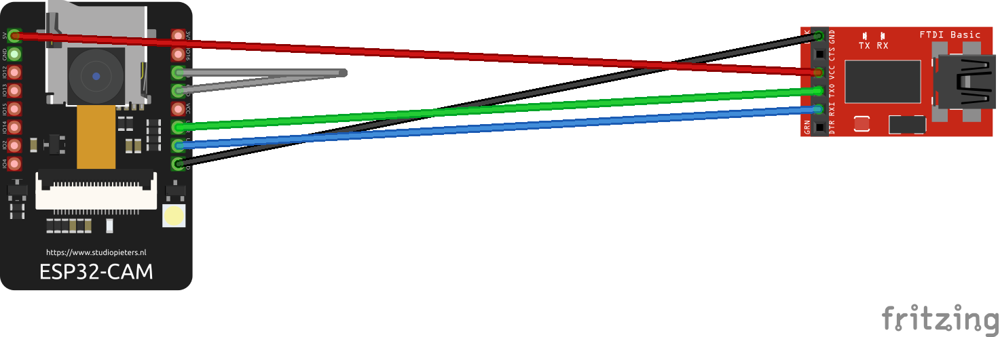

# Camera module software
> This folder contains the code running on the camera module, an ESP32-CAM module. It has `/capture` endpoint serving an image of the remote.

## Setup to work with the ESP32-CAM

### Arduino IDE
> To work with this existing project, open the esp32-cam.ino file with Arduino IDE.

1. In `File>Preferences` in the field `Additional boards manager URLs` add the following two lines:
```
https://arduino.esp8266.com/stable/package_esp8266com_index.json
https://raw.githubusercontent.com/espressif/arduino-esp32/gh-pages/package_esp32_index.json
```
2. In `Tools>Board>Boards Manager` install the `esp32` package.
3. In `Tools>Board>esp32` select `AI Thinker ESP32-CAM`
4. For the Serial connection, set the baud to `115200` (dropdown at the top right of the serial console).

#### Setting the WIFI credentials
The WIFI credentials (SSID and Password) are set in the main Arduino project file: `esp32-cam.ino`. At the top of the file (line ~35) the credentials have to be set in the following lines:
```
// ===========================
// Enter your WiFi credentials
// ===========================
const char* ssid = "wifi-ssid";
const char* password = "wifi-password";
```

#### Flashing
`GND` and `IO0` need to be connected while powering on the ESP for it to boot in flashable mode. Use a cable to connect them. To boot the flashed program, remove the cable and reboot (i.e. power cycle) the ESP with the two pins not connected.

### Wiring

as described in the Course Handbook in Chapter 25.4  
note the two pins that need to be bridged (only) during flashing